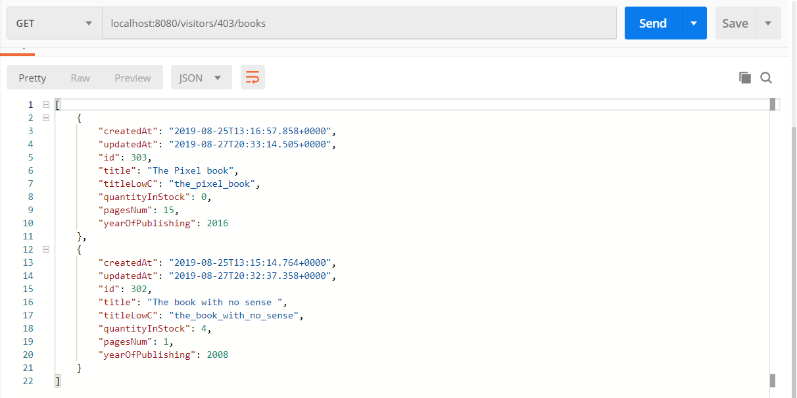

# Bookworm app

Simple library API which implements Many-To-Many relationship between library visitors and books.

**Used technologies:**
* Java
* Spring Boot
* Hibernate
* PostgreSQL RDBMS

**Screenshots:**

